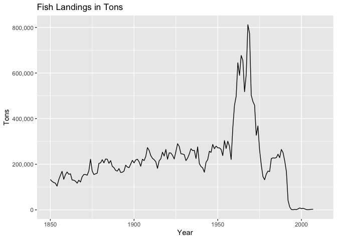
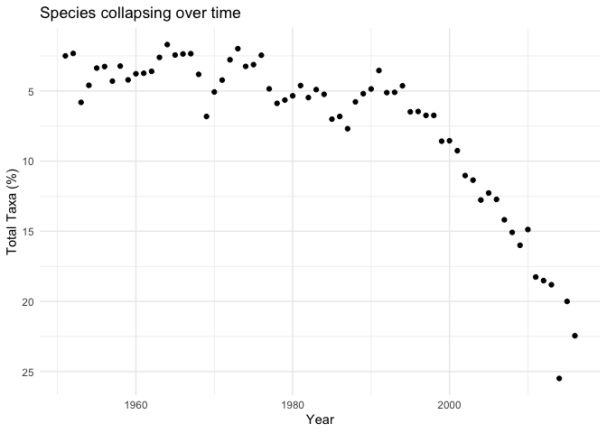

``` r
knitr::opts_chunk$set(message = FALSE)
```

Fisheries Collapse Module
=========================

We are seeking to replicate the study that is portrayed.


Cod Collapse Model
------------------

This portion of the report references Cod from Canada and United States displayed into a graph to determine the point of collapse in the fish species. This is meant to be a replication of the original study using the data which is referenced in this article

-   [Link the the original study](https://doi.org/10.5281/zenodo.2542918)

``` r
library("tidyverse")
```

    ## Warning: package 'ggplot2' was built under R version 3.5.2

    ## Warning: package 'tibble' was built under R version 3.5.2

    ## Warning: package 'tidyr' was built under R version 3.5.2

    ## Warning: package 'purrr' was built under R version 3.5.2

    ## Warning: package 'dplyr' was built under R version 3.5.2

    ## Warning: package 'stringr' was built under R version 3.5.2

    ## Warning: package 'forcats' was built under R version 3.5.2

``` r
library("readxl")
```

    ## Warning: package 'readxl' was built under R version 3.5.2

``` r
excel_version <- "RLSADB v4.44/DB Files With Assessment Data/RLSADB v4.44 (assessment data only).xlsx"
if(!file.exists(excel_version)){
  download.file("https://zenodo.org/record/2542919/files/RLSADB%20v4.44.zip?download=1",
                "ramlegacy.zip")
unzip("ramlegacy.zip") 
}
```

``` r
cod <-
    ram$timeseries %>% 
    left_join(ram$stock) %>% 
    left_join(ram$area) %>% 
    left_join(ram$tsmetrics, by = c("tsid" = "tsunique")) %>%
    filter(stockid == "COD2J3KL", #
           country == "USA" | country == "Canada") %>% 
    filter(tsid == "TC-MT") %>% 
    arrange(tsyear) %>% group_by(tsyear) %>%
    summarise(total_catch = sum(tsvalue)) %>%
    mutate(maxcatch = cummax(total_catch)) %>%
    mutate(collapsed = total_catch < (maxcatch * 0.1)) %>%
    ggplot(aes(x = tsyear, y = total_catch), na.rm = TRUE) +
    geom_line() +
    labs( x = "Year", y = "Tons", title = "Fish Landings in Tons") +
    scale_y_continuous(labels = scales::comma) 
   
cod
```

    ## Warning: Removed 4 rows containing missing values (geom_path).



Looking at this graph and starting in 1850 we can see that there is a small unptrend in how many fish landings there were. This trend is modestly increasing until 1950, where there is a significant increase in total catch of the Cod species. This could be due to technological improvements that make it easier to catch and track fish. It may also be attributed to an exponentially increase of human population and total demand of Cod fish. Nontheless, this results in a dramatic increase and then drastic decline in the species, when there should have been major red flags and regulations implimented to prevented any further fishing. It is seen that even with boundaries that were implimented around fishing in the late 1970's we only see a slight uptrend into the early 1990's. After the 1990's the decline begins again and reaches a point where the species can no longer be fished, which results in zero fish landings. Here you can see the decline in species to the point were fishing it was either banned or not feasible.

``` r
#Code for simple methods of of filtering and arranging data. 

count(ram$stock) %>% arrange(n) 
```

    ## # A tibble: 1 x 1
    ##       n
    ##   <int>
    ## 1  1372

``` r
ram$timeseries %>% count(tsid) %>% arrange(tsid)
```

    ## # A tibble: 259 x 2
    ##    tsid                            n
    ##    <chr>                       <int>
    ##  1 AQ-MT                          68
    ##  2 BdivBmgtpref-dimensionless  41253
    ##  3 BdivBmgttouse-dimensionless 21323
    ##  4 BdivBmsypref-dimensionless  41253
    ##  5 BdivBmsytouse-dimensionless 25697
    ##  6 Cadvised-MT                   452
    ##  7 CdivMSY-ratio               20024
    ##  8 Cpair-E00                     106
    ##  9 Cpair-MT                     4564
    ## 10 CPUE-1-E00/tow                 20
    ## # … with 249 more rows

``` r
ram$tsmetrics %>% filter(tscategory == "CATCH or LANDINGS") %>% distinct() 
```

    ## # A tibble: 57 x 6
    ##    tscategory   tsshort  tslong           tsunitsshort tsunitslong tsunique
    ##    <chr>        <chr>    <chr>            <chr>        <chr>       <chr>   
    ##  1 CATCH or LA… Cadvised Scientific advi… MT           Metric tons Cadvise…
    ##  2 CATCH or LA… CdivMSY  Catch divided b… ratio        ratio       CdivMSY…
    ##  3 CATCH or LA… Cpair    Catch or landin… E00          Individuals Cpair-E…
    ##  4 CATCH or LA… Cpair    Catch or landin… MT           Metric tons Cpair-MT
    ##  5 CATCH or LA… CUSTC    Customary catch  MT           Metric tons CUSTC-MT
    ##  6 CATCH or LA… ILLC     Illegal catch    MT           Metric tons ILLC-MT 
    ##  7 CATCH or LA… RecC     Recreational ca… E00          Individuals RecC-E00
    ##  8 CATCH or LA… RecC     Recreational ca… MT           Metric tons RecC-MT 
    ##  9 CATCH or LA… TAC-A1   Total allowable… MT           Metric tons TAC-A1-…
    ## 10 CATCH or LA… TAC-A2   Total allowable… MT           Metric tons TAC-A2-…
    ## # … with 47 more rows

``` r
#ram$tsmetrics %>% select(tsunique) %>% distinct() %>% arrange()
#ram$timeseries %>% select(tsid) %>% distinct() %>% arrange()

#we want year and fish landings in tons in order to get the right graphs

ram$tsmetrics %>% filter(tscategory == "CATCH or LANDINGS") #%>% count(tslong)
```

    ## # A tibble: 57 x 6
    ##    tscategory   tsshort  tslong           tsunitsshort tsunitslong tsunique
    ##    <chr>        <chr>    <chr>            <chr>        <chr>       <chr>   
    ##  1 CATCH or LA… Cadvised Scientific advi… MT           Metric tons Cadvise…
    ##  2 CATCH or LA… CdivMSY  Catch divided b… ratio        ratio       CdivMSY…
    ##  3 CATCH or LA… Cpair    Catch or landin… E00          Individuals Cpair-E…
    ##  4 CATCH or LA… Cpair    Catch or landin… MT           Metric tons Cpair-MT
    ##  5 CATCH or LA… CUSTC    Customary catch  MT           Metric tons CUSTC-MT
    ##  6 CATCH or LA… ILLC     Illegal catch    MT           Metric tons ILLC-MT 
    ##  7 CATCH or LA… RecC     Recreational ca… E00          Individuals RecC-E00
    ##  8 CATCH or LA… RecC     Recreational ca… MT           Metric tons RecC-MT 
    ##  9 CATCH or LA… TAC-A1   Total allowable… MT           Metric tons TAC-A1-…
    ## 10 CATCH or LA… TAC-A2   Total allowable… MT           Metric tons TAC-A2-…
    ## # … with 47 more rows

``` r
#ram$timeseries_values_views %>% 
  #filter(tsn == "164712")

  ram$area
```

    ## # A tibble: 821 x 6
    ##    country  areatype areacode areaname          alternateareana… areaid    
    ##    <chr>    <chr>    <chr>    <chr>             <chr>            <chr>     
    ##  1 Argenti… CFP      ARG-N    Northern Argenti… NA               Argentina…
    ##  2 Argenti… CFP      ARG-S    Southern Argenti… NA               Argentina…
    ##  3 Austral… AFMA     CASCADE  Cascade Plateau   NA               Australia…
    ##  4 Austral… AFMA     EAUS     Eastern Australia NA               Australia…
    ##  5 Austral… AFMA     ESE      Eastern half of … NA               Australia…
    ##  6 Austral… AFMA     GAB      Great Australian… NA               Australia…
    ##  7 Austral… AFMA     MI       Macquarie Island  <NA>             Australia…
    ##  8 Austral… AFMA     NAUST    Northern Austral… NA               Australia…
    ##  9 Austral… AFMA     NSWWA    New South Wales … NA               Australia…
    ## 10 Austral… AFMA     SE       Southeast Austra… NA               Australia…
    ## # … with 811 more rows

``` r
ram$area %>% count(country)
```

    ## # A tibble: 13 x 2
    ##    country           n
    ##    <chr>         <int>
    ##  1 Argentina         2
    ##  2 Australia        16
    ##  3 Canada          182
    ##  4 Chile             9
    ##  5 Iran              1
    ##  6 Japan            37
    ##  7 multinational   220
    ##  8 Multinational     3
    ##  9 New Zealand      45
    ## 10 Peru              1
    ## 11 Russia           31
    ## 12 South Africa      8
    ## 13 USA             266

------------------------------------------------------------------------

Stock Collapses as a whole
--------------------------

In this portion of the study we are aiming to replicate the model displayed below 

Our goal is to replicate this study by Worm using the following data - [Link to study](http://doi.org/10.1126/science.1132294)

``` r
#new task requires getting all of the species
#use a group_by function instead of filter 
#group by scientificname, tsyear 
#then use a summarise function
#we need a column for collapsed taxa
#upper lines mean fish got out of the collapse 
#lower lines mean fish did not recover and collapsed
#you need to know how many taxa you have to decide a % of collapsed missing

cod <-
    ram$timeseries %>% 
    left_join(ram$stock) %>% 
    left_join(ram$area) %>% 
    left_join(ram$tsmetrics, by = c("tsid" = "tsunique")) %>%
    filter(stockid == "COD2J3KL", 
           country == "USA" | country == "Canada") %>% 
    filter(tsid == "TC-MT") %>% 
    arrange(tsyear) %>% group_by(tsyear) %>%
    summarise(total_catch = sum(tsvalue)) %>%
    mutate(maxcatch = cummax(total_catch)) %>%
    mutate(collapsed = total_catch < (maxcatch * 0.1)) %>%
    ggplot(aes(x = tsyear, y = total_catch), na.rm = TRUE) +
    geom_line() +
    labs( x = "Year", y = "Tons", title = "Fish Landings in Tons") +
    scale_y_continuous(labels = scales::comma)

fish <-
    ram$timeseries %>% 
    left_join(ram$stock) %>% 
    left_join(ram$area) %>% 
    left_join(ram$tsmetrics, by = c("tsid" = "tsunique")) %>%
    filter(tsid == "TC-MT") %>% 
    arrange(tsyear) %>% 
    group_by(tsn, tsyear) %>%
    summarise(total_catch = sum(tsvalue, na.rm = TRUE)) %>%
    mutate(maxcatch = cummax(total_catch)) %>%
    mutate(collapsed = total_catch < (maxcatch * 0.1)) %>%
    mutate(indicator = collapsed * 1) %>%
    group_by(tsyear) 
   
collapsed_fish <-
  fish %>% filter(collapsed == TRUE) %>%
    summarize(total = n())  

total_fish <- 
  fish %>% summarise(total_count = n())

fish_plot <-
  left_join(collapsed_fish, total_fish) %>%
  mutate(percent = total/ total_count * 100)
  
fish_plot
```

    ## # A tibble: 114 x 4
    ##    tsyear total total_count percent
    ##     <dbl> <int>       <int>   <dbl>
    ##  1   1896     2           9   22.2 
    ##  2   1897     2           9   22.2 
    ##  3   1898     2           9   22.2 
    ##  4   1899     3          10   30   
    ##  5   1900     3          14   21.4 
    ##  6   1901     1          15    6.67
    ##  7   1902     1          15    6.67
    ##  8   1904     1          15    6.67
    ##  9   1907     2          17   11.8 
    ## 10   1908     1          17    5.88
    ## # … with 104 more rows

``` r
  ggplot(filter(fish_plot, tsyear > 1950 & tsyear < 2017), 
    aes(x = tsyear, y = percent), na.rm = TRUE) +
    geom_point() + 
    scale_y_reverse()+
    labs( x = "Year", y = "Total Taxa (%)", title = "Species collapsing over time") +
    theme_minimal()
```



We wanted to created a true/ false column for species that collapsed here. It is evident when searching the data that every species didn't collapse in 1800's. Although the goal was to create a marker for species to show that if it collapsed then it stayed collapsed thorugh the end of the data. We struggled with this concept becuase understanding how many species there truly were was hard to justify in code itself.

Our approach created a plot that showed the decline in cod species relative to the total number of species in the data tables. We were able to create a True and False column of when species collapsed however it was not 100% accurate according to how Worm concluded the data.

Part of the problem here is that we wanted to know every species that had been overfished into oblivion from 1850 and what percent relative to all species were collapsing. We were able to see this from 1950 but dates prior made it very difficult to seperate which taxa had declined fully and which haven't. This came down to a simple coding understanding. Despite the barrier of understanding it is still clear that looking at individual species, as is vaugely shown in this graph, there is a sharp decline leading to a collapse.
